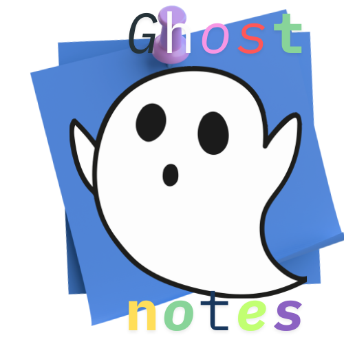
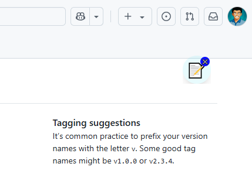
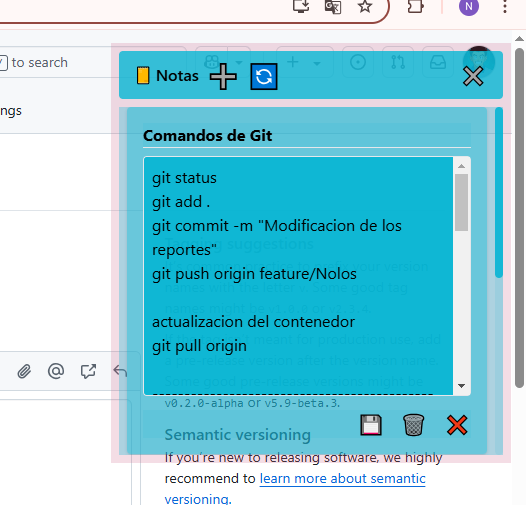

# 📝 GhostNotes


¡**GhostNotes** es tu compañero perfecto para tomar notas de forma rápida y elegante! 🚀 Con un dock flotante siempre visible y una ventana de notas minimalista, esta app te permite gestionar tus ideas en cualquier momento. Diseñada con un estilo moderno y funcional, es ideal para usuarios que buscan simplicidad y eficiencia. 🎨💻

---

## ✨ Características

📍 **Dock Flotante**  
Icono flotante (📝) casi imperseptible que puede colocar en cualquier lougar de la pantalla para acceder a tus notas de manera rapida.  
- Clic para abrir la ventana de notas.  


📝 **Gestión de Notas**  
Crea, edita y elimina notas con facilidad.  
- **Crear**: Añade una nueva nota con ➕.  
- **Editar**: Modifica título y contenido, y guarda con 💾.  
- **Eliminar**: Borra notas con 🗑️ (eliminación inmediata).  
- **Cerrar**: Oculta la ventana con ❌.  
- **Recargar**: Actualiza la lista con 🔄.  
- Soporte para notas largas sin límite práctico.

💾 **Acceso rapido a tus Notas**  
Tus notas se guardan automáticamente y puedes acceder a ellas en cualquier momento.

🎨 **Diseño Moderno**  
Interfaz estilizada y responsiva con Tailwind CSS.

---

## 🛠️ Tecnologías Usadas

⚡ **Electron**: Framework para aplicaciones de escritorio multiplataforma.  
📜 **JavaScript**: Lógica de la app (proceso principal y renderer).  
🎨 **HTML5/CSS**: Interfaz de usuario. 
💅 **Tailwind CSS**: Estilos modernos y consistentes.  
🌐 **Node.js**: Entorno para dependencias y empaquetado.  
🔧 **Electron Forge**: Herramienta para empaquetar y generar instaladores (con Squirrel para Windows).  

---

## 📸 Capturas de Pantalla

**Dock Flotante** 📍  


**Tus notas a un clic**


**Ventana de Notas** 📝  



---

## 🔧 Instalación

Sigue estos pasos para instalar **GhostNotes** en tu computadora:

### 📋 Requisitos
- Sistema operativo: Windows (probado en Windows 10/11).  
- No se necesitan dependencias adicionales.

### 📥 Pasos para Instalar
1. Descarga el instalador desde [GitHub Releases](https://github.com/Nolos17/ghostNotes/releases/tag/v1.0.0). 
2. Ejecuta `GhostNotes.exe`.  
3. Espera a que se inicie la aplicación.  
   - Se crea un acceso directos en tu escritorio.  
4. Disfruta de la aplicación.

---

## 🚀 Para Desarrolladores: Modificar y Empaquetar

¿Quieres personalizar GhostNotes o empaquetarlo en otro computador? Aquí tienes los pasos:

### 📋 Requisitos
- **Node.js** (versión 18 o superior).  
- Editor de código (recomendado: Visual Studio Code).  
- Sistema operativo compatible con Electron (Windows, macOS, Linux).

### 📦 Pasos
1. **Clonar o Copiar el Proyecto**  
   Transfiere la carpeta del proyecto o clona el repositorio:  
   ```bash
   git clone https://github.com/Nolos17/ghostNotes
   cd ghostnotes
   ```

2. **Instalar Dependencias**  
   ```bash
   npm install
   ```

3. **Configurar Tailwind CSS**  
   Genera los estilos:  
   ```bash
   npx tailwindcss -i ./public/css/input.css -o ./public/css/tailwind.css
   ```  
   Para desarrollo, usa:  
   ```bash
   npm run tailwind
   ```

4. **Modificar el Código**  
   Archivos clave:  
   - `main.js`: Lógica principal (ventanas, persistencia).  
   - `public/notes.html`, `public/dock.html`: Interfaz.  
   - `js/notes.js`, `js/dock.js`: Lógica del renderer.  
   - `public/css/input.css`: Estilos con Tailwind.

5. **Probar Cambios**  
   Inicia la app en modo desarrollo:  
   ```bash
   npm start
   ```

6. **Empaquetar**  
   Genera el ejecutable:  
   ```bash
   npm run package
   ```  
   Esto crea `out/ghostnotes-win32-x64/barra-notas.exe` (en Windows).

7. **Crear Instalador**  
   Genera el instalador:  
   ```bash
   npm run make
   ```  
   Encuentra `GhostNotes.exe` en `out/make/squirrel.windows/x64/`.

---

## 🎯 Instrucciones de Uso

📍 **Abrir Notas**  
Haz clic en el dock flotante (📝) para abrir la ventana de notas.

📝 **Gestionar Notas**  
- **Crear**: Clic en ➕ para una nueva nota.  
- **Editar**: Cambia título/content y guarda con 💾.  
- **Eliminar**: Usa 🗑️ para borrar (eliminación inmediata).  
- **Cerrar**: Clic en ❌ para ocultar la ventana.  
- **Recargar**: Usa 🔄 para actualizar la lista.

💾 **Persistencia**  
Tus notas se guardan automáticamente y persisten entre sesiones.

🚪 **Cerrar la App**  
Usa el botón ✕ en el dock para cerrar completamente.

---

## 🤝 Contribuir

¡Tus ideas son bienvenidas! 🌟 Para contribuir:  
1. 🍴 Haz un fork del repositorio.  
2. 🌱 Crea una rama (`git checkout -b mi-caracteristica`).  
3. ✍️ Realiza tus cambios y haz commit (`git commit -m "Añadir característica"`).  
4. 🚀 Sube tu rama (`git push origin mi-caracteristica`).  
5. 📬 Abre un Pull Request en GitHub.  

Por favor, sigue el estilo del código y añade comentarios si es necesario.

---

## 📜 Licencia

Este proyecto está licenciado bajo la **Licencia MIT**. Consulta el archivo `LICENSE` para más detalles.

---

## 📞 Soporte

¿Tienes problemas o sugerencias?  
- Contacta al desarrollador: [noloststorres@gmail.com](noloststorres@gmail.com).  
- Abre un issue en el repositorio (si está en GitHub).

¡Disfruta de tomar notas con **GhostNotes**! 📝✨